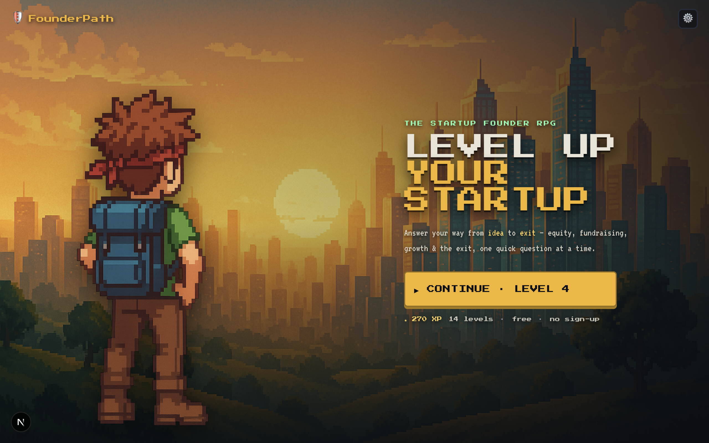
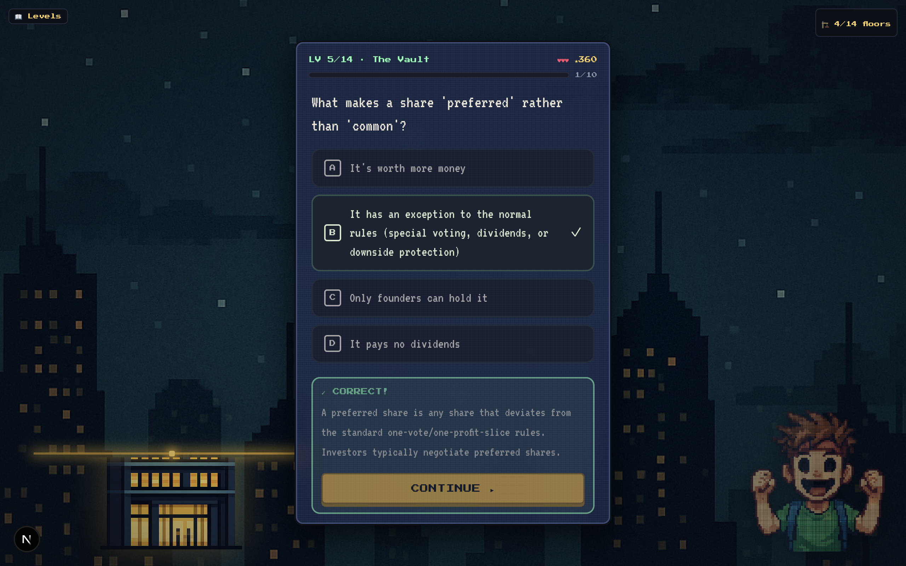

# FounderPath

A pixel-art RPG that teaches the entire startup journey — equity, valuations, convertible
notes, SAFEs, fundraising, growth, retention, team scaling, and the exit — one quick question
at a time. Learn by playing through **14 unlockable levels, idea → exit**.

**▶ Play it live: https://thefounderpath.vercel.app**



## Play

Tap **Play**, answer questions, and watch your startup tower rise as you clear levels. Your
founder cheers when you're right and ponders when you're wrong. Each correct answer banks XP and
unlocks the next level. Progress saves to your browser — come back and continue where you left off.



## The journey

The Foundry → City Hall → The Oracle → The Bridge → The Vault → The Arena → The Negotiation →
The Audit → The Scribes → The Academy → **The Crossroads** (choose a growth path: Product-/Sales-/Marketing-led)
→ The Guild → The Kingdom → The Summit.

## Run locally

```bash
npm install
npm run dev   # http://localhost:3000
```

## Tech

Next.js (App Router) · TypeScript · Tailwind CSS · Framer Motion. No backend, no login —
progress persists in `localStorage`.
